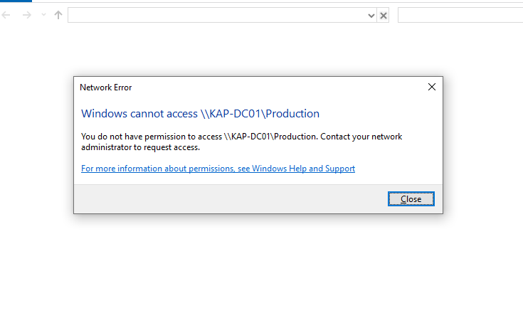
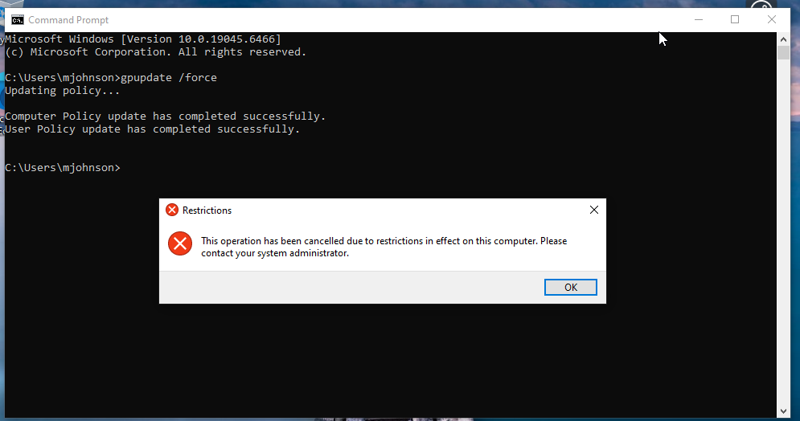
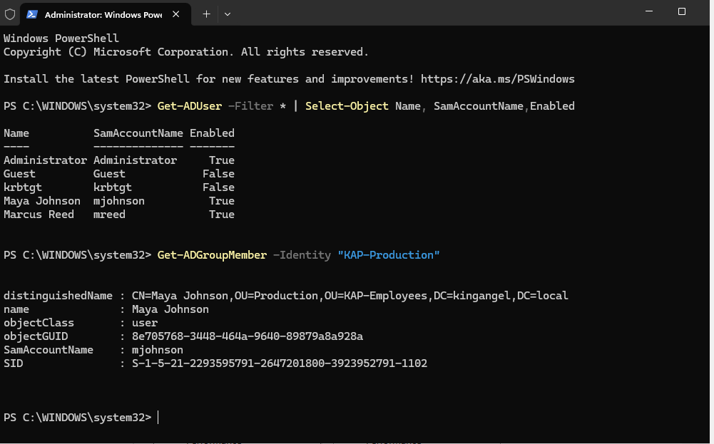

# Enterprise Help Desk & Active Directory Support Lab

## Overview

This project simulates an enterprise Windows environment for a fictional company, King Angel Productions.

I built a Windows Server domain environment, configured Active Directory Domain Services (AD DS) and DNS, created an organizational structure for multiple departments, provisioned domain users and security groups, joined a Windows 10 workstation to the domain, configured role-based access to company resources, implemented Group Policy, and performed common Help Desk troubleshooting tasks.

The purpose of this lab was to develop and demonstrate hands-on skills used in Help Desk, IT Support, Active Directory administration, Identity and Access Management (IAM), Windows administration, networking, access control, troubleshooting, and PowerShell.

---

## Skills Demonstrated

- Windows Server administration
- Active Directory Domain Services (AD DS)
- Active Directory Users and Computers (ADUC)
- Domain controller configuration
- DNS configuration and troubleshooting
- Organizational Units (OUs)
- User provisioning and account administration
- Security group administration
- Identity and Access Management (IAM)
- Group-based access control
- Principle of least privilege
- Windows domain joining
- Domain user authentication
- Password resets
- Account lockout troubleshooting
- Group Policy administration
- Network share configuration
- Share and NTFS permissions
- PowerShell Active Directory administration
- Static IP and DNS configuration
- Windows Time synchronization
- Network troubleshooting
- Help Desk ticket troubleshooting

---

## Lab Environment

### Domain Controller

- **Hostname:** KAP-DC01
- **Operating System:** Windows Server 2025 Standard Evaluation
- **Domain:** kingangel.local
- **NetBIOS Domain:** KINGANGEL
- **Private IP Address:** 192.168.50.10
- **Server Roles:** Active Directory Domain Services (AD DS) and DNS

### Employee Workstation

- **Hostname:** HelpDeskLab-Fixed
- **Operating System:** Windows 10
- **Private IP Address:** 192.168.50.20
- **Domain:** kingangel.local

### Virtualization

The environment was built using Oracle VirtualBox.

Two virtual network connections were used:

- **NAT** — Internet connectivity
- **KAP-LAN** — Private internal network between the domain controller and workstation

---

## Network Architecture

```text
                         Internet
                            |
                           NAT
                            |
              +-------------+-------------+
              |                           |
         KAP-DC01                  HelpDeskLab-Fixed
      Windows Server 2025             Windows 10
       192.168.50.10                192.168.50.20
              |                           |
              +--------- KAP-LAN ---------+
                   Private Network

Domain: kingangel.local
```

---

# Active Directory Configuration

## Organizational Unit Structure

I created a parent Organizational Unit named:

`KAP-Employees`

Departmental OUs were then created to organize users based on their business roles:

- Production
- Finance
- Human Resources
- Marketing
- IT Security
- Executives

This structure allows users and policies to be managed based on department and job function.


---

## Security Groups

I created Global Security Groups for each major department:

- KAP-Production
- KAP-Finance
- KAP-HR
- KAP-Marketing
- KAP-IT-Security
- KAP-Executives

Rather than assigning permissions directly to individual employees, users were assigned to security groups.

The access-control model used throughout the lab was:

```text
User
  ↓
Security Group
  ↓
Resource Permission
```

This makes access easier to administer and follows the principle of least privilege.

---

# Domain User Provisioning

Multiple employee accounts were created to simulate real company users.

## Maya Johnson

- **Username:** mjohnson
- **Department:** Production
- **Security Group:** KAP-Production

Maya was created with a temporary password and required to change the password at first login.

## Marcus Reed

- **Username:** mreed
- **Role:** Payroll Specialist
- **Department:** Finance
- **Security Group:** KAP-Finance

Marcus was also created with a temporary password and required to change it at first login.

---

# Windows 10 Domain Join

The Windows 10 workstation was configured with the private IP address:

`192.168.50.20`

The workstation's DNS configuration was pointed toward the domain controller:

`192.168.50.10`

After verifying network and DNS connectivity, the workstation was successfully joined to:

`kingangel.local`

I then authenticated to Windows using the domain account:

`KINGANGEL\mjohnson`

The `whoami` command verified the authenticated identity:

```text
kingangel\mjohnson
```


---

# DNS Troubleshooting

During the domain-join process, the workstation initially used an incorrect DNS server.

The workstation was attempting DNS resolution through:

`192.168.1.254`

instead of the Active Directory DNS server:

`192.168.50.10`

I tested basic connectivity to the domain controller:

```powershell
ping 192.168.50.10
```

The ping completed successfully, proving that basic IP connectivity existed.

I then tested DNS directly against the domain controller:

```powershell
nslookup kingangel.local 192.168.50.10
```

The domain resolved successfully.

I corrected the workstation DNS configuration using PowerShell:

```powershell
Set-DnsClientServerAddress -InterfaceAlias "Ethernet" -ServerAddresses 192.168.50.10
```

After correcting DNS, normal domain name resolution succeeded and the workstation was able to join the domain.

### Troubleshooting Lesson

This demonstrated an important troubleshooting concept:

```text
Successful network connectivity does not necessarily mean DNS is working.
```

Active Directory relies heavily on DNS, so DNS should be validated when troubleshooting domain authentication and domain-join problems.

---

# Role-Based File Share Permissions

A Production department network share was created on the domain controller.

### Server Folder

`C:\KAP-Shares\Production`

### Network Path

`\\KAP-DC01\Production`

## Share Permissions

The default broad access was removed and the following security group was granted access:

`KAP-Production`

Permissions:

- Change
- Read

Full Control was not granted.

## NTFS Permissions

`KAP-Production` was granted **Modify** permission, which provided the necessary ability to:

- Read files
- Create files
- Modify files
- List folder contents
- Execute files

The resulting access model was:

```text
Maya Johnson
      ↓
KAP-Production
      ↓
Production Shared Folder
```

---

## Authorized Access Test

I logged into the domain workstation as Maya Johnson.

Because Maya belongs to `KAP-Production`, she successfully accessed:

`\\KAP-DC01\Production`

Maya then created:

`Maya-Production-Test.txt`

This confirmed that authorized Production employees could access and modify the departmental share.


---

## Unauthorized Access Test

To verify least-privilege access controls, I logged into the domain workstation as Marcus Reed.

Marcus belongs to the Finance department and is not a member of `KAP-Production`.

Marcus attempted to access:

`\\KAP-DC01\Production`

Windows denied the request.

This confirmed that the Production share was restricted to authorized members of the `KAP-Production` security group.



---

# Help Desk Account Troubleshooting

## Account Lockout

A common Help Desk scenario was simulated by intentionally entering Maya Johnson's password incorrectly multiple times.

After repeated failed authentication attempts, Maya's domain account became locked.

Using Active Directory Users and Computers, I located Maya's account and performed an account unlock.

Maya was then able to authenticate successfully using her correct credentials.

This simulated a typical Help Desk workflow:

```text
User reports login problem
        ↓
Help Desk investigates account
        ↓
Locked account identified
        ↓
Account unlocked
        ↓
User authentication verified
```

---

## Forgotten Password / Password Reset

A second authentication ticket simulated a user who had forgotten their password.

Using Active Directory Users and Computers, I:

1. Located Maya Johnson's account.
2. Selected **Reset Password**.
3. Assigned a temporary lab password.
4. Enabled **User must change password at next logon**.
5. Verified that the temporary password allowed authentication.
6. Confirmed Windows required Maya to create a new password before completing sign-in.
7. Verified successful access after the password change.

This demonstrated a standard enterprise Help Desk password-reset workflow while ensuring the Help Desk technician did not permanently control the employee's password.

---

# Group Policy Administration

I created a Group Policy Object named:

`KAP Employee Security Policy`

The GPO was linked to the `KAP-Employees` OU.

A user policy was configured to prohibit employee access to Windows Control Panel and PC settings.

The configured policy was:

`Prohibit access to Control Panel and PC settings`

The policy was set to **Enabled**.

On the Windows 10 workstation, I forced Group Policy processing using:

```cmd
gpupdate /force
```

After troubleshooting a time-synchronization issue, both Computer Policy and User Policy updated successfully.

When Maya attempted to open Control Panel, Windows displayed a restriction message stating that the operation had been cancelled due to restrictions on the computer.

This confirmed that the centrally managed Group Policy was successfully delivered from the domain environment and enforced on the employee workstation.



---

# Windows Time Synchronization Troubleshooting

While testing Group Policy, the workstation reported:

```text
Computer Policy could not be updated successfully.
The computer's clock is not synchronized with the clock of one of the domain controllers.
```

I investigated the issue instead of manually bypassing it.

The workstation identified its domain time source as:

`KAP-DC01.kingangel.local`

However, the domain controller was initially using:

`Local CMOS Clock`

The domain controller was also configured with an incorrect time zone and incorrect system date.

I corrected the server time zone and date and configured the domain controller to use an external NTP source.

The Windows Time configuration was updated with:

```cmd
w32tm /config /manualpeerlist:"time.windows.com,0x8" /syncfromflags:manual /reliable:yes /update
```

The Windows Time service was restarted:

```cmd
net stop w32time
net start w32time
```

The domain controller was then successfully synchronized:

```cmd
w32tm /resync
```

I returned to the Windows 10 workstation and ran:

```cmd
w32tm /resync
```

The workstation successfully synchronized with the domain environment.

Finally, I reran:

```cmd
gpupdate /force
```

Both Computer Policy and User Policy completed successfully.

### Troubleshooting Process

```text
Group Policy failure
        ↓
Clock synchronization error identified
        ↓
Workstation time source investigated
        ↓
Domain controller time configuration investigated
        ↓
NTP source configured
        ↓
Windows Time service restarted
        ↓
Domain controller synchronized
        ↓
Workstation synchronized
        ↓
Group Policy successfully applied
```

This demonstrated troubleshooting across authentication, Active Directory, Windows Time, Group Policy, and network services.

---

# PowerShell Active Directory Administration

In addition to using graphical Active Directory management tools, I used PowerShell to query the domain.

To display Active Directory users and their account status:

```powershell
Get-ADUser -Filter * | Select-Object Name,SamAccountName,Enabled
```

This returned domain accounts including Maya Johnson and Marcus Reed.

I then queried the Production security group:

```powershell
Get-ADGroupMember -Identity "KAP-Production"
```

The output confirmed that Maya Johnson was a member of `KAP-Production`.



Using PowerShell provides a faster and more scalable method for administering and auditing Active Directory environments than relying exclusively on graphical tools.

---

# Help Desk Ticket Summary

| Ticket | Issue | Priority | Resolution |
|---|---|---|---|
| KAP-001 | New employee/domain account provisioning | Medium | Created domain users, assigned appropriate OUs and security groups, and verified authentication |
| KAP-002 | User account locked after failed login attempts | High | Identified locked account in Active Directory, unlocked account, and verified successful login |
| KAP-003 | User forgot domain password | Medium | Reset password, issued temporary credentials, required password change at next login, and verified access |
| KAP-004 | Finance employee unable to access Production share | Medium | Verified user was not authorized for Production resources and confirmed access denial was expected least-privilege behavior |
| KAP-005 | DNS/domain connectivity issue | High | Identified incorrect DNS configuration, corrected DNS to use the domain controller, and verified domain resolution |
| KAP-006 | Group Policy failed because of clock synchronization | High | Investigated Windows Time configuration, configured NTP, synchronized domain systems, and successfully reapplied Group Policy |

---

# Problems Encountered and Resolutions

## PowerShell Access Denied

A network configuration command initially returned **Access is denied**.

### Cause

PowerShell had not been opened with administrative privileges.

### Resolution

PowerShell was reopened using **Run as administrator** and the command completed successfully.

---

## Incorrect PowerShell Parameter

While configuring the workstation IP address, an incorrect parameter spelling caused the command to fail.

### Resolution

The command syntax was reviewed, corrected, and executed successfully.

This reinforced the importance of carefully reading PowerShell error messages rather than assuming the underlying technology is failing.

---

## DNS Resolution Failure

The workstation could reach the domain controller by IP address but initially could not properly resolve the Active Directory domain.

### Resolution

I used `ping` and `nslookup` to separate network connectivity from DNS resolution, identified the incorrect DNS configuration, and pointed the workstation to the domain controller's DNS service.

---

## Group Policy / Time Synchronization Failure

Group Policy processing failed because the workstation and domain controller clocks were not synchronized.

### Resolution

I investigated Windows Time, corrected the domain controller's date/time configuration, configured an external NTP source, restarted the Windows Time service, synchronized both systems, and successfully reapplied Group Policy.

---

# Key Lessons Learned

- Active Directory depends heavily on properly configured DNS.
- Successful IP connectivity does not guarantee successful name resolution.
- Organizational Units organize and manage directory objects, while security groups are used to assign access.
- Permissions should generally be assigned to security groups rather than individual users.
- Share permissions and NTFS permissions work together to determine effective network resource access.
- Least privilege should be tested by verifying both authorized and unauthorized access.
- Help Desk technicians must understand account lockouts, password resets, authentication, and access-control troubleshooting.
- Group Policy provides centralized management of domain users and computers.
- Accurate time synchronization is critical to Windows domain authentication and Group Policy.
- PowerShell provides efficient ways to query and administer Active Directory.
- Troubleshooting should follow a logical process instead of randomly changing settings.

---

# Project Status

✅ **Complete**

This lab successfully simulated an enterprise Windows domain and common Help Desk / IT Support administration tasks.

### Completed Tasks

- Installed and configured Windows Server 2025
- Deployed Active Directory Domain Services
- Promoted KAP-DC01 to a domain controller
- Configured DNS
- Created the kingangel.local domain
- Created departmental Organizational Units
- Created department-based security groups
- Provisioned Active Directory users
- Configured static IP addressing and DNS
- Joined a Windows 10 workstation to the domain
- Verified domain-user authentication
- Created a departmental network share
- Configured Share and NTFS permissions
- Implemented group-based access control
- Tested authorized resource access
- Tested unauthorized resource access
- Simulated and resolved an account lockout
- Performed a Help Desk password reset
- Required password change at next login
- Created and linked a Group Policy Object
- Enforced Group Policy on a domain workstation
- Diagnosed and resolved Windows Time synchronization problems
- Used PowerShell to query Active Directory
- Documented Help Desk tickets and troubleshooting procedures

---

## Conclusion

This project provided hands-on experience building and supporting a small enterprise Windows environment from the ground up.

Rather than only configuring Active Directory, the lab focused on realistic support scenarios involving identity, authentication, DNS, permissions, password management, account lockouts, Group Policy, time synchronization, PowerShell, and troubleshooting.

The environment demonstrates practical skills applicable to entry-level roles including **Help Desk Technician, IT Support Specialist, Service Desk Analyst, Desktop Support Technician, Junior Systems Administrator, IAM Analyst, and other Windows enterprise support roles.**
