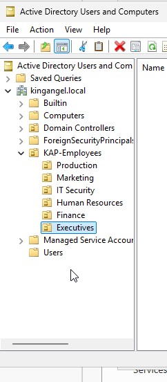
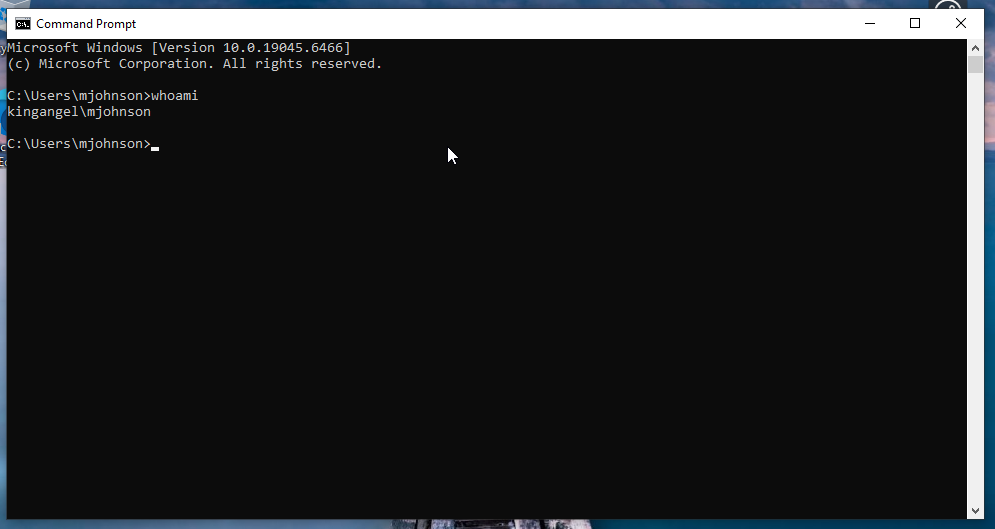
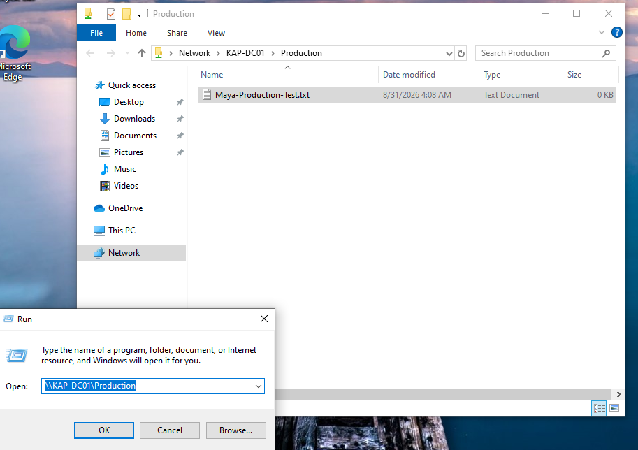

# Enterprise Help Desk & Active Directory Support Lab

## Overview

This project simulates an enterprise Windows environment for a fictional company, King Angel Productions. I built a Windows Server domain controller, configured Active Directory Domain Services (AD DS) and DNS, created an organizational structure for multiple departments, provisioned domain users, implemented security groups, joined a Windows 10 workstation to the domain, and configured role-based access to shared company resources.

The purpose of this lab is to demonstrate hands-on skills used in Help Desk, IT Support, Active Directory administration, identity and access management, Windows administration, networking, and troubleshooting.

## Skills Demonstrated

- Windows Server administration
- Active Directory Domain Services (AD DS)
- Active Directory Users and Computers (ADUC)
- Domain controller configuration
- DNS configuration and troubleshooting
- Organizational Units (OUs)
- User provisioning
- Security group administration
- Group-based access control
- Principle of least privilege
- Windows domain joining
- Domain user authentication
- Network share configuration
- Share and NTFS permissions
- PowerShell
- Static IP and DNS configuration
- Basic network troubleshooting

- ## Lab Environment

### Domain Controller

- **Hostname:** `KAP-DC01`
- **Operating System:** Windows Server 2025 Standard Evaluation
- **Domain:** `kingangel.local`
- **NetBIOS Domain:** `KINGANGEL`
- **Private IP Address:** `192.168.50.10`
- **Server Roles:** Active Directory Domain Services (AD DS) and DNS Server

### Employee Workstation

- **Virtual Machine:** `HelpDeskLab-Fixed`
- **Operating System:** Windows 10
- **Private IP Address:** `192.168.50.20`
- **Domain:** `kingangel.local`

### Virtualization & Networking

- Oracle VirtualBox
- NAT adapter for internet connectivity
- Internal VirtualBox network: `KAP-LAN`
- Domain Controller and workstation connected through the private `KAP-LAN` network

## Network Architecture

```text
                         Internet
                            |
                           NAT
                            |
             +--------------+--------------+
             |                             |
         KAP-DC01                  HelpDeskLab-Fixed
    Windows Server 2025               Windows 10
     Domain Controller               Workstation
       AD DS + DNS
             |                             |
      192.168.50.10                  192.168.50.20
             |                             |
             +---------- KAP-LAN ----------+
```

## Active Directory Organizational Structure

I created a parent Organizational Unit (OU) named `KAP-Employees` to organize company user accounts.

Under `KAP-Employees`, I created separate departmental OUs for:

- Production
- Finance
- Human Resources
- Marketing
- IT-Security
- Executives

This structure separates users by business function and provides a foundation for centralized administration, Group Policy, and access management.

### Department Security Groups

I created Global Security Groups for each department:

- `KAP-Production`
- `KAP-Finance`
- `KAP-HR`
- `KAP-Marketing`
- `KAP-IT-Security`
- `KAP-Executives`

Instead of assigning resource permissions directly to individual employees, users are assigned to security groups based on their job responsibilities.

This follows a scalable access-control model:

`User → Security Group → Resource Permission`

### Active Directory OU Structure



## Domain User Provisioning

I created domain user accounts in Active Directory and placed each employee in the appropriate departmental Organizational Unit.

### Maya Johnson

- **Username:** `mjohnson`
- **Department:** Production
- **OU:** Production
- **Security Group:** `KAP-Production`
- Required to change temporary password at first login

### Marcus Reed

- **Username:** `mreed`
- **Position:** Payroll Specialist
- **Department:** Finance
- **OU:** Finance
- **Security Group:** `KAP-Finance`
- Required to change temporary password at first login

This process demonstrated user provisioning, departmental organization, security group membership, and role-based access management.

## Windows 10 Domain Join

I configured the Windows 10 workstation with the private IP address `192.168.50.20` and configured the domain controller at `192.168.50.10` as its DNS server.

After verifying network connectivity and DNS resolution, I successfully joined the workstation to:

`kingangel.local`

I then authenticated to the workstation using Maya Johnson's Active Directory account:

`KINGANGEL\mjohnson`

I verified the authenticated identity using:

I verified the authenticated identity using:

```cmd
whoami
```

The command returned:

```text
kingangel\mjohnson
```

This confirmed that the workstation was successfully joined to the domain and that Active Directory authentication was functioning.

### Domain User Authentication



## Role-Based File Share Permissions

To demonstrate group-based access control, I created a shared Production folder on the domain controller:

```text
C:\KAP-Shares\Production
```

The folder was shared across the network as:

```text
\\KAP-DC01\Production
```

### Share Permissions

I removed the default `Everyone` permission and granted the `KAP-Production` security group:

- Change
- Read

I intentionally did not grant Full Control to regular Production users in order to follow the principle of least privilege.

### NTFS Permissions

I also configured NTFS permissions for the `KAP-Production` security group and granted:

- Modify
- Read & Execute
- List Folder Contents
- Read
- Write

Permissions were assigned to the department security group rather than directly to an individual user.

This creates the following access model:

`Maya Johnson → KAP-Production → Production Shared Folder`

## Authorized Access Test

While logged into the domain workstation as Maya Johnson, I accessed:

```text
\\KAP-DC01\Production
```

I successfully created:

```text
Maya-Production-Test.txt
```

This verified that Maya received the appropriate access through her membership in the `KAP-Production` security group.

### Production Share Access



## DNS Troubleshooting

During the domain-join process, the Windows 10 workstation initially attempted to resolve the Active Directory domain using the wrong DNS server.

The workstation was querying:

```text
192.168.1.254
```

However, the Active Directory DNS server was running on the domain controller at:

```text
192.168.50.10
```

### Troubleshooting Process

I first verified basic network connectivity to the domain controller:

```powershell
ping 192.168.50.10
```

The test returned four successful replies with 0% packet loss, confirming that the workstation could communicate with the domain controller over the network.

I then queried the domain controller's DNS service directly:

```powershell
nslookup kingangel.local 192.168.50.10
```

The domain resolved successfully, confirming that the DNS service on `KAP-DC01` was functioning.

I corrected the workstation's DNS configuration using PowerShell:

```powershell
Set-DnsClientServerAddress -InterfaceAlias "Ethernet" -ServerAddresses 192.168.50.10
```

I then tested normal DNS resolution again:

```powershell
nslookup kingangel.local
```

The workstation successfully used `192.168.50.10` to resolve the domain.

### Resolution

The issue was caused by the workstation using the wrong DNS server rather than the Active Directory-integrated DNS server.

After correcting the DNS configuration, the workstation successfully located `kingangel.local` and joined the domain.

## Problems Encountered

### PowerShell Administrative Permissions

When I initially attempted to configure the Windows 10 workstation's static IP address, PowerShell returned an `Access is denied` error.

I determined that PowerShell had not been launched with administrative privileges. I reopened PowerShell using **Run as Administrator** and successfully configured the network adapter.

### PowerShell Syntax Error

While configuring the workstation IP address, I initially mistyped the `-IPAddress` parameter.

After reviewing the command syntax and correcting the parameter, the static IP configuration completed successfully.

### DNS Resolution Issue

Although the workstation could successfully ping the domain controller, it initially could not properly resolve the Active Directory domain because it was using the wrong DNS server.

I isolated the DNS issue using `ping` and `nslookup`, corrected the workstation's DNS configuration, verified name resolution, and successfully joined the workstation to the domain.

## Lessons Learned

This lab helped me understand how several Windows enterprise technologies work together rather than treating them as separate concepts.

Key lessons included:

- Active Directory relies heavily on properly configured DNS.
- Successful network connectivity does not guarantee successful domain name resolution.
- Organizational Units organize and help administer Active Directory objects, while security groups are used to assign resource access.
- Permissions should generally be assigned to security groups instead of individual users.
- Share permissions and NTFS permissions work together when users access network resources.
- Least privilege means providing enough access for a user to perform their job without unnecessarily granting administrative control.
- Troubleshooting should follow a logical process of testing connectivity, name resolution, authentication, and permissions rather than changing multiple settings at once.

## Project Status

🚧 **In Progress**

### Completed

- Windows Server 2025 installation
- Active Directory Domain Services deployment
- Domain controller promotion
- DNS configuration
- `kingangel.local` domain creation
- Organizational Unit structure
- Department security groups
- Domain user provisioning
- Windows 10 private network configuration
- DNS troubleshooting
- Windows 10 domain join
- Domain-user authentication
- Production network share creation
- Share permission configuration
- NTFS permission configuration
- Authorized Production access testing

### Remaining

- Unauthorized access testing
- Account lockout and password-reset troubleshooting
- Group Policy configuration
- Additional PowerShell administration
- Help Desk ticket simulations
- Final documentation

### Key Takeaway

This demonstrated an important Active Directory troubleshooting principle: successful IP connectivity does not necessarily mean domain services will work. DNS must also be configured correctly so clients can locate domain resources and services.
